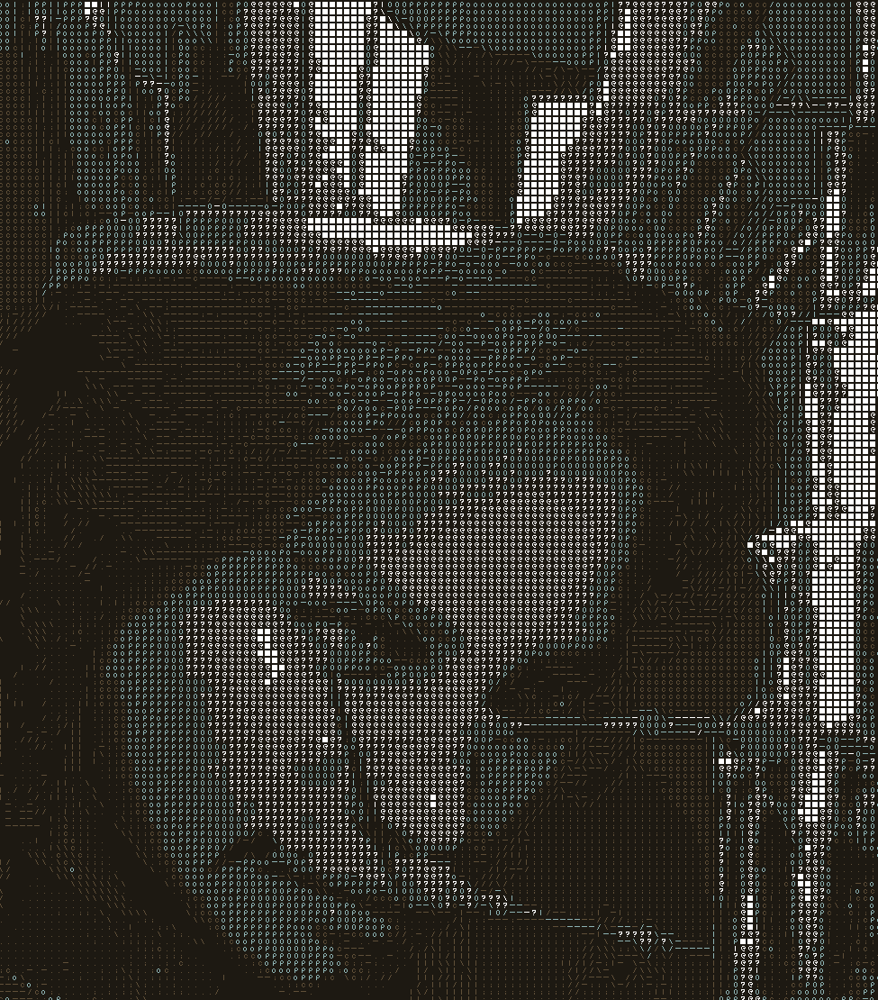
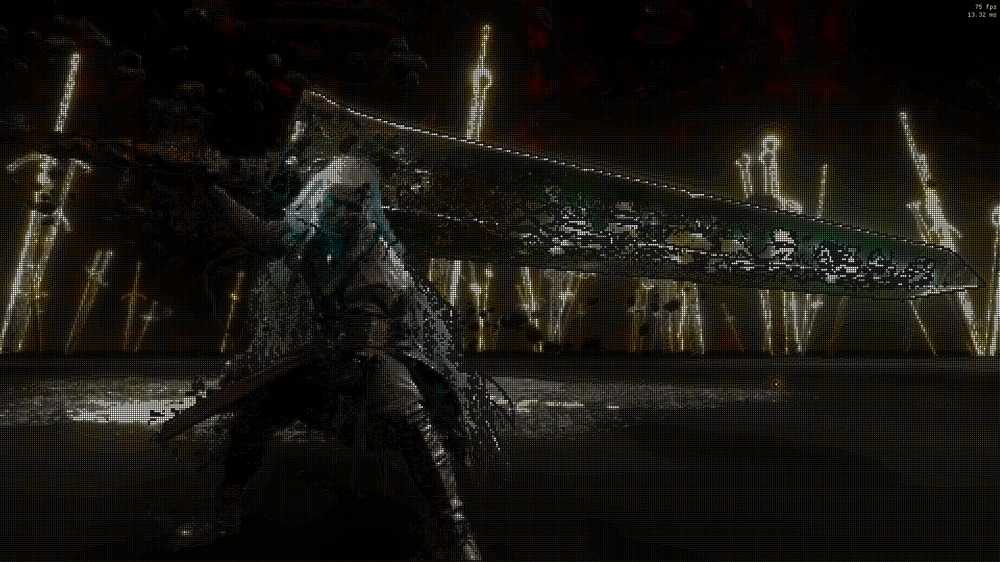
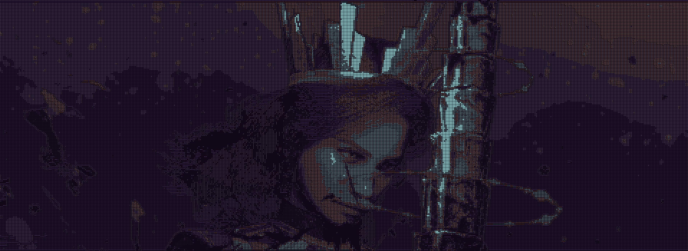

# ASCII Art Shader

### Created by Jack Ye

This is a real-time ReShade effect that converts a game's image into ASCII art
using luminance, contours, and depth.

## Overview

The image is divided into 8×8 cells and represented using ASCII glyphs of
different densities. Darker areas use glyphs with fewer lit pixels, while
brighter areas use denser glyphs.

Unlike basic ASCII filters, this shader can detect important visual contours
and render directional line glyphs to represent them. Its two-pronged approach
can identify edges from both luminance gradients and depth gradients.

The project is packaged as a ReShade effect, allowing it to run as a
post-processing effect in existing games.

## Main features

- Edge-aware glyphs: Detects important contours and represents them using
  directional line glyphs (`/`, `\`, `|`, and `-`)

- Depth-aware contours: When available, uses the game's depth buffer to better
  define foreground objects

- Temporal stability: Reduces distracting edge flicker while preserving
  responsive motion

- Two glyph ramps: Provides a lightweight standard set and a more detailed
  expanded set

- Flexible styling: Supports monochrome, cell-based colour tinting, and
  generated colour palettes

- Perceptual palette generation: Uses the Oklab colour space and common
  harmonies to generate aesthetic colour palettes

## Screenshots

See the [development diary](docs/index.md) for more screenshots :)

## Installation

1. Download and install ReShade from the
   [official ReShade website](https://reshade.me/) for the game's executable.
2. Download `JackYe-ASCII-Shader-v1.0.0.zip` from the
   [latest GitHub release](https://github.com/Luniversity/Ascii-Art-Shader/releases/latest).
3. Extract the package directly into the folder containing the game executable
   and ReShade. Allow its `reshade-shaders` folder to merge with the existing
   folder.
4. Launch the game, open the ReShade overlay, and enable the `JackYeAscii`
   technique.

### Optional depth-aware contours

The effect works without depth information. To use depth-aware contours,
enable **Depth Edges** and select a usable depth buffer under
**Add-ons > Generic Depth**. The shader's **Linearized Depth** diagnostic
should show nearby objects as dark and distant objects as light.

If the depth is incorrect, open **Edit Global Preprocessor Definitions** in
ReShade and try the following:

- If near and far values are reversed, toggle
  `RESHADE_DEPTH_INPUT_IS_REVERSED` between `0` and `1`.
- If the image is upside down, toggle
  `RESHADE_DEPTH_INPUT_IS_UPSIDE_DOWN` between `0` and `1`.

Apply the changes and reload the effects. If the game does not expose a usable
depth buffer, leave **Depth Edges** disabled.

## Limitations

- Depth-aware contours require ReShade to have access to a usable game depth buffer. Availability and configuration vary between games and graphics APIs.
- The shader cannot understand things like material, or importance of individual objects. Detailed textures may therefore be interpreted as contours, while subtle edges may be missed.
- Temporal stabilization reduces edge flicker but cannot remove it completely. It uses screen-space history without motion vectors.
- The effect will also transform HUD and menu elements, depending on when a game
  renders its interface relative to ReShade.
- Performance is resolution-dependent because the image and edge-processing
  stages operate across the rendered frame.

## License and credits

Original project code is available under the [MIT License](LICENSE), copyright
© 2026 Jack Ye.

The standard fill atlas is derived from `fillASCII.png`, and the edge atlas is
based on `edgesASCII.png`, from
[Garrett Gunnell's AcerolaFX](https://github.com/GarrettGunnell/AcerolaFX).
The expanded fill atlas is treated as AcerolaFX-derived for attribution. These
assets are used under Garrett Gunnell's
[MIT License](ThirdParty/AcerolaFX/LICENSE.md).

The shader's Oklab conversion matrices are from
[Björn Ottosson's Oklab reference](https://bottosson.github.io/posts/oklab/),
made available as public-domain and MIT-licensed material.

Unless stated otherwise, diary screenshots, photographs, captured game imagery,
and other third-party media are not covered by this project's MIT License.
Their rights remain with their respective owners.
