<link rel="stylesheet" href="assets/site.css">

# ASCII Art Shader

## Contents

- [Day 0 — So how do we do this?](#day-0)
- [Day 1 — Make it exist first](#day-1)
- [Day 2 — Edge detection](#day-2)
- [Day 3 — Edge detection for real now](#day-3)
- [Day 4 — Rendering the edges](#day-4)
- [Day 5 — Performance and optimization](#day-5)
- [Day 6 — Dynamic luminance quantization](#day-6)
- [Day 7 — ReShade porting](#day-7)
- [Day 8 — Stability, colour and depth](#day-8)
- [Day 9 — Expanded glyphs and colour palettes](#day-9)

---

## Day 0 - So how do we do this?

Turning an image into ASCII sounds simple at first. Let's say each symbol is 8x8 pixels large. We divide up the entire screen into 8x8 slots. We analyze each slot to see which symbol fits (yea this is the complicated part). Then we draw the symbol in that position. 

Yes there are a bunch of things I should do to make the output "look more like" the input, but I'll worry about them later. 

Here is the first test scene I made. It rotates, that's it. GG

## Day 1 - Make it exist first

I'll start by making the smallest complete path from camera image -> shader -> back to the screen. So basically creating a shader that does nothing but pass the same information along.

Holy hell the shader exists and makes things more red

A fragment shader normally treats every output pixel independently. But for my ASCII rendering, groups of pixels need to form cells that later become ASCII characters. So we need: individual screen pixels -> groups of pixels in fixed cells. We can then analyze each cell to determine its symbol.

I'm on a 4k screen so idk how small pixel counts will look on my screen physically. I might try to just work on 1080p idk. 

Next, I created the actual cells. The cells are just fixed-size squares.

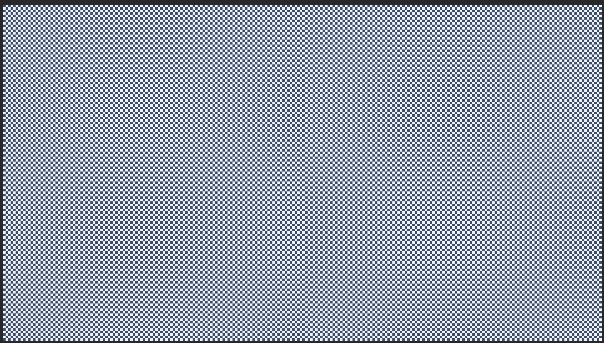

The cell size here is 8px on a 1080p screen. That looks like a size to put symbols on. 16px is too big, and 4px kinda drowns out the cells. 

But this is just an arbitrary checkerboard pattern. I need to actually make use of the screen pixels and do stuff with them. The simplest thing I could do is choose the center pixel of each cell and fill that cell with its colour.

Now it looks like a "poorly" downscaled image of the original scene. 

So far we are making every cell a square. But a lot of fonts are rectangular. So I should make sure that cells can have sizes like 8x16 pixels and still work. 

8x32 sized cells. Tall cells look kinda weird. Hopefully it pays off to have flexible cell sizes. 

I now have a good foundation for figuring out which ASCII symbol to put on the screen. I need to turn the RGB colours into luminance, then convert that into a symbol using an index.

At this point I only care about luminance
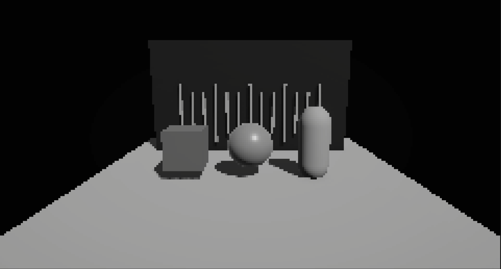

Luminance is continuous and the ASCII symbols are very much discrete. So we will need to do some quantization. 

I don't have the symbols yet so we will just quantize the colours. I basically made a resolution and colour downscaler.

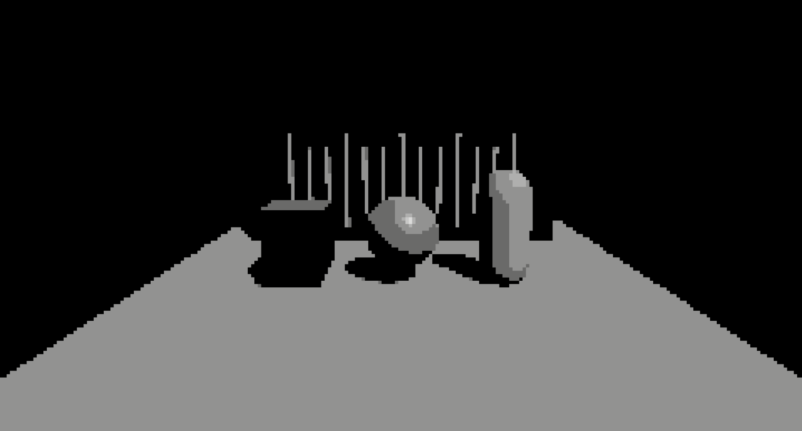

8 colours only (imagine this is 8 different symbols)

With 8 colours I chose 8 symbols that are kind of spread out evenly when it comes to density

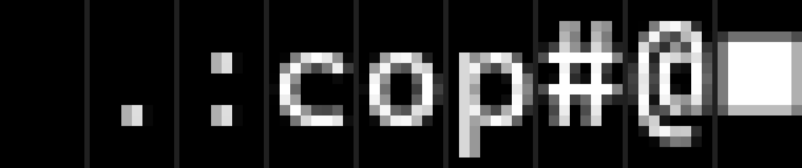

(The first one is blank since it's the spacebar)

And now if we render each symbol at its corresponding place we get this:

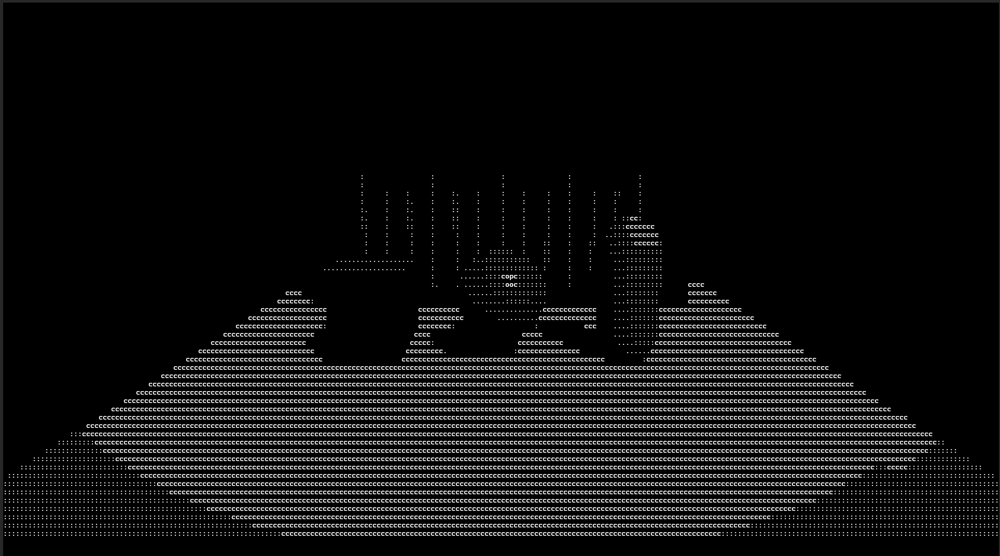

ASCII art version 0 has been achieved.

But this setup uses 8x16 cells and is not very "pixel-like". I think it would be better if we actually used square fonts. This is what it looks like if I just squashed the current font down to a square:

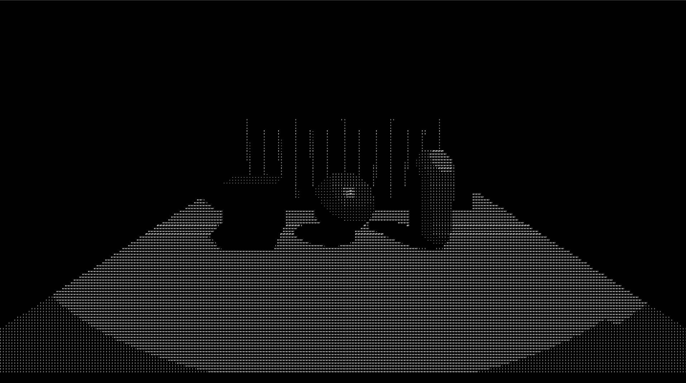

The structure here looks much better, it's just that the symbols look a bit wacky. 

I then replaced the font with an actual square one. Now we can render cells at 8x8. It's tiny though so squint :)

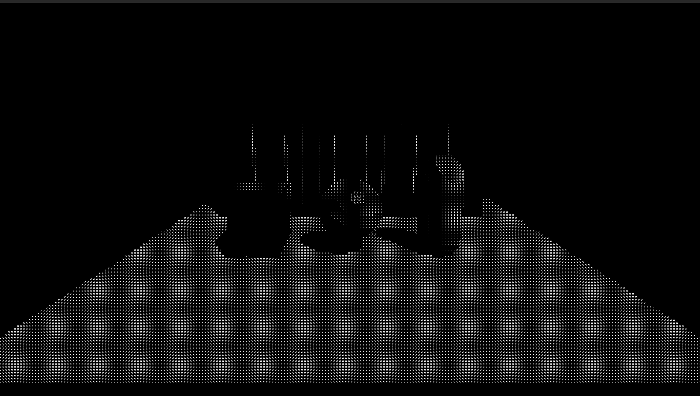

Now the structure is even and the font looks right. 

Next I want to go back and improve the cell sampling. For each cell, I currently just look at the center of the cell and use that for calculating luminance. A better way to do this is to actually downscale the image by 8 so that we get a blurred/lower resolution version of the image. 

Looks a bit cleaner. I also increased the intensity of the light so we get a better range of luminance.

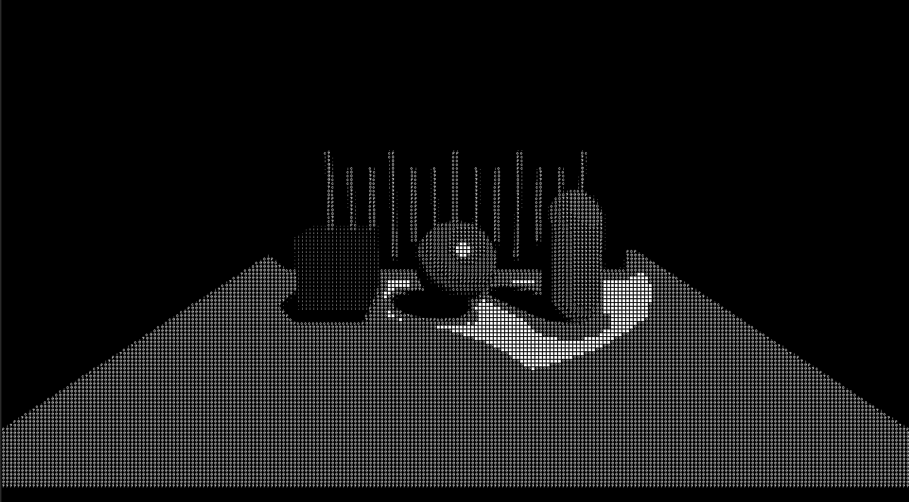

A good thing to add early on is debugging views:

Cell colour: what the image looks like after downscaling
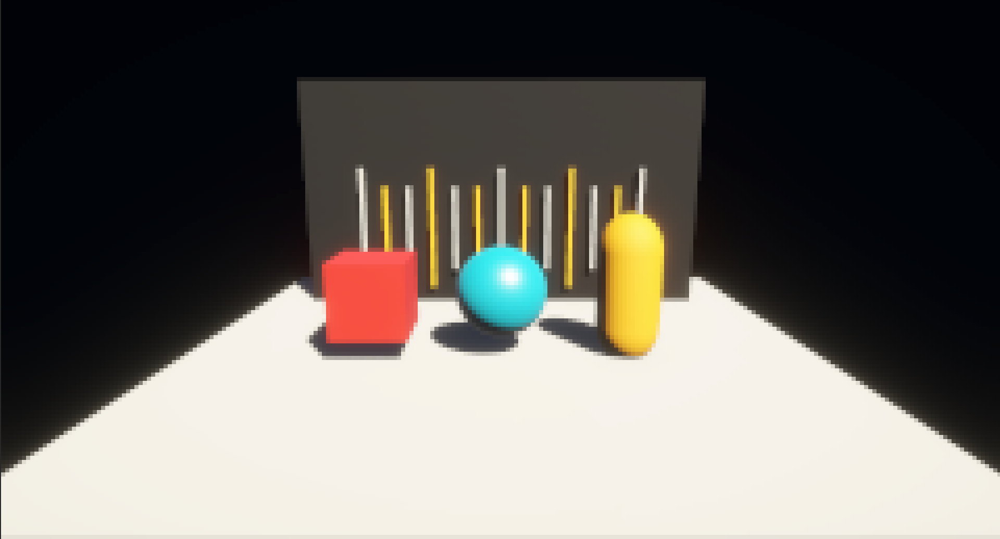

Luminance: what the image looks like after converting RGB to luminance
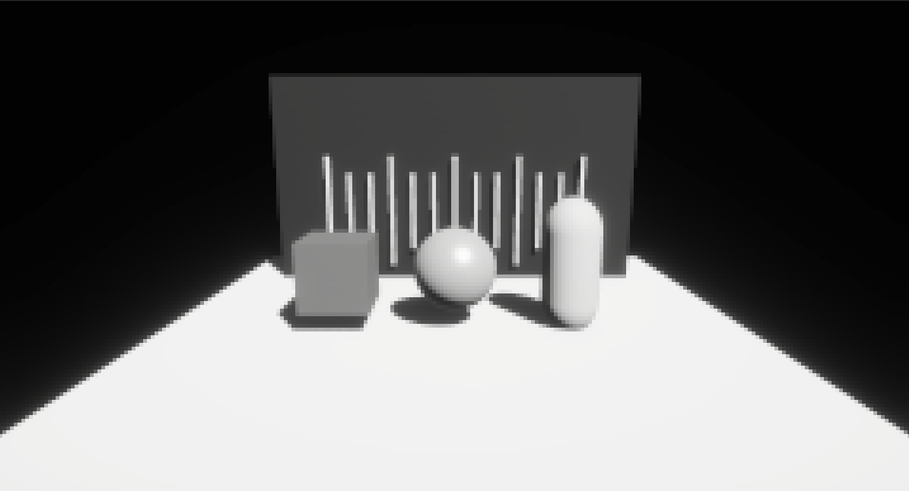

GlyphIndex: what the image looks like after quantizing but before rendering any glyphs
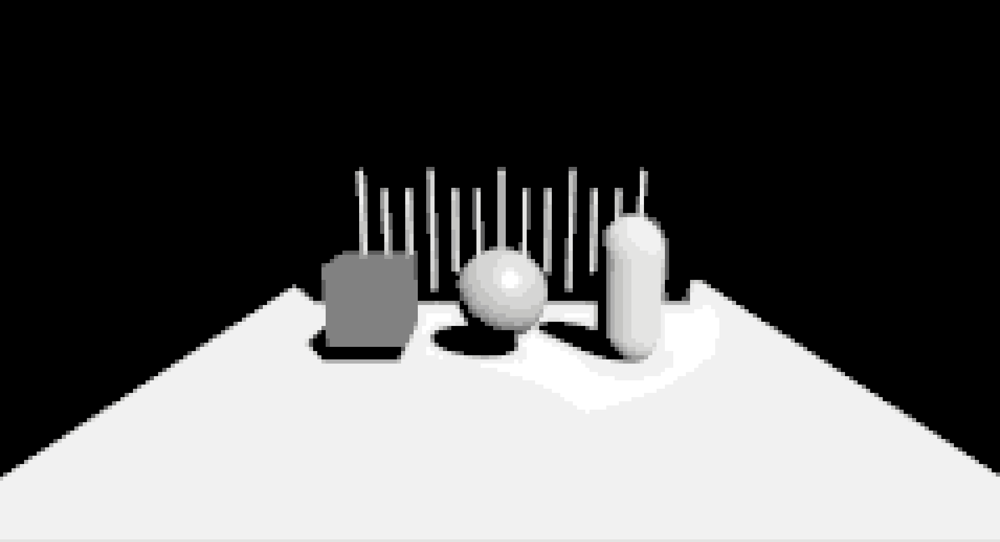

Looking at a bunch of pure white and pure black pixels does hurt your eyes. One easy fix for this is to just make the two colours we have, black and white, into something less black and less white. So I added a colour palette view mode to decrease the contrast a bit.

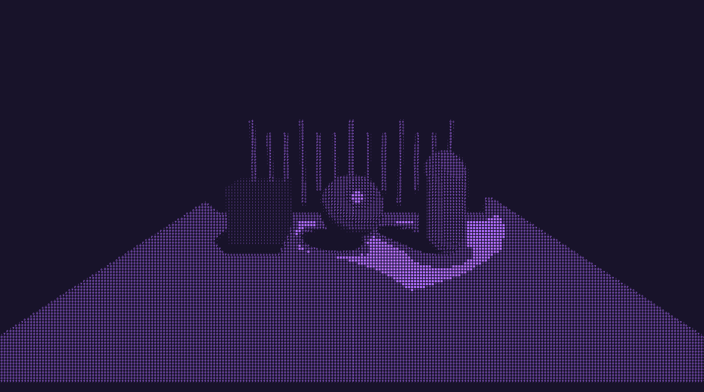

I could stare at this for at least 5 min

I asked codex to generate colour palettes and I can already envision a website that looks like this

## Day 2 - Edge detection

What we have now is basically a way to represent different luminance levels using ASCII symbols. That is technically what the goal is. But ASCII art is not about representing an image in this kind of accurate way. It mostly uses defined edges to create something a bit more stylized. 

ASCII art is more this:
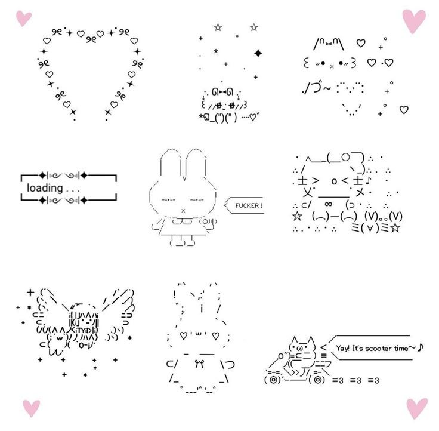

Than this:

So we need a way to render clear edges so that shapes become more defined. More formally, we need to find strong, coherent image contours at full resolution and reduce them to one meaningful directional symbol per cell.

The symbols we are going to use are: | — / \ 

A cell below the edge threshold remains blank in the edge image. A qualifying cell receives the glyph that best follows the detected line. Then we can combine the edge-only image with the luminance based image into a composite. 

There are a lot of things to consider here, and many potential ways of doing it.
We need to preserve thin edges, so we have to do the edge detection before any downsampling (otherwise the edges will be blurred away). The edge detection needs to output both the edge strength and its direction, so that we can put the corresponding symbol on it. A Sobel filter is ideal.

We need to properly differentiate big and small gradients. A texture might have a lot of edges, but we would be wasting our time trying to add edges to it. So we need a way to preprocess the image so that only important edges are selected. 

Since we are creating 8x8 cells, we might have multiple contradicting edges inside a cell. So we need a way of measuring how consistently the pixels agree on one orientation. One cell can only have one edge direction.

Lastly we need not forget that we are aiming for real time processing.

## Day 3 - Edge Detection for real now

The Sobel filter would need a full-resolution version of our greyscale (luminance) image. The edge-detection "materials" would go on a separate branch. Before downscaling, we grab a full-resolution linear luminance texture for later. 

Full resolution luminance image:
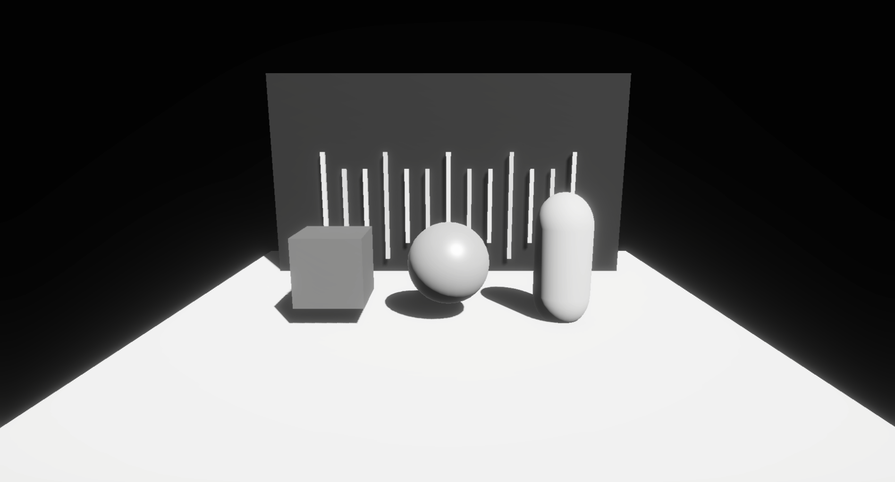

Next we will actually perform the Sobel filter. 
Here are the debug views to visualize the "edges" (gradients).

Sobel Magnitude: bright areas are higher magnitude gradients

Sobel Direction: different directions of the output vectors are coloured differently

The filter differentiates whether the gradient is going up or down, left or right, while we only care about whether the "edge" is vertical, horizontal or diagonal.
A gradient pointing left <- or right -> corresponds to a vertical line, while a gradient pointing up or down corresponds to a horizontal line. 

Looking at the result of the Sobel filter makes me believe that we are close to getting a finalized edge detection algorithm. But given that the test environment is just some default Unity 3D objects, it is probably not a suitable environment anymore. We need more variation, details, and overall complexity. 

Now I could import something fancy or make a more complex scene, but it would be just easier to just work on a photograph instead. So I'll just plaster one on. 

Here is the Sobel direction view for an actual photograph with details:

So clearly there are a lot of "not edges" lit up here. The filter does not differentiate actual contours from noise caused by high-frequency textures. If you look at the floor at the bottom, we are detecting a lot of edges, while in reality it is just a textured floor

However, there is good news. The colouring (the direction of the gradients) is quite on point. Looking at the cityscape, I can tell that the filter correctly identified the contours of the buildings (even though they might get drowned out by the downscaling later)

So what we need to do is some pre-processing to help the Sobel filter a bit. We really just need a way to reduce high-frequency patterns while keeping the larger boundaries. 

The simplest way of doing that is by blurring. Blurring might get rid of details (we want that but it is a scary thought), but remember that we are going to downsample anyway, so details will be gone no matter what. 

Here is what the before and after looks like with and without a Gaussian blur.
Before:

After:
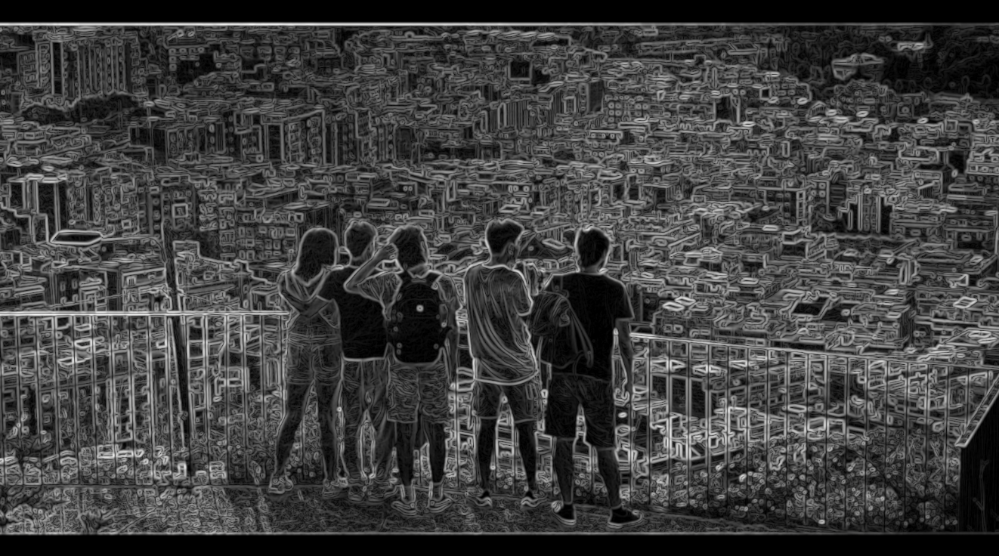

Yea no, blurring like this kind of just emphasizes lower frequency details, and makes the contours thicker. It also does not solve the weird textures on the asphalt.
If we only add a light blur, we get unwanted texture edges. If we make the blur strong, the contours start disappearing. 

What we really need is more of a band-pass filter that preserves details at a scale where we actually care. We don't need to consider every tiny edge, we only care when they are large enough to be represented by the ASCII cells. If we use a Difference of Gaussians (small blur - large blur), we can preserve structures around the scale we want while suppressing both tiny textures and larger gradients. Then we can give the output to Sobel to find the edges. 

The difference of gaussians (DoG from now on) idea was useful, but it took a lot of testing to understand what it was actually useful for. 

So basically we blur the luminance image twice. Once with a smaller blur and once with a larger blur. Then we subtract them to get the DoG output. The two blur inputs look nearly identical on their own. This is fine since the DoG works by amplifying their small differences, not by comparing an obviously sharp image against an obviously blurry one. The goal is to make structures around a useful scale stand out, while reducing tiny texture and very broad lighting changes.

At first, just feeding this result into Sobel did not give us the clean contours we wanted. The output still behaved too much like a normal edge detector: lots of thin lines, fragmented texture, and not enough clear shape. 

(I swapped the test image to an image of a church since the cityscape image was way too busy)
You can see the contour lines of the church, but the edges are not clear enough to just hand over to Sobel yet. I decided to let DoG simplify the image into regions, then let Sobel trace the boundaries between them. 

The DoG result is still a greyscale image containing continuous values, but we want to simplify it into clear regions before applying Sobel. 

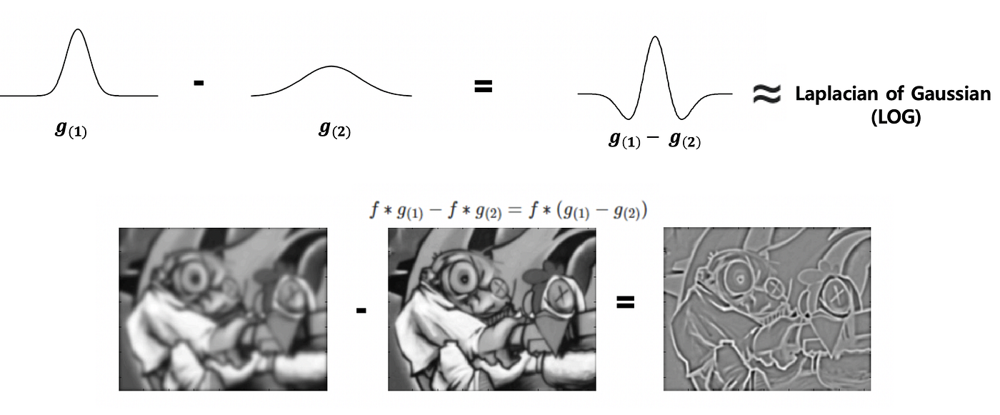

The small blur preserves more local detail, while the large blur spreads that information over a wider area. In parts of the image that change very slowly, the two blurred values are almost equal and cancel each other out. Around boundaries, however, they differ.

This creates a positive response on one side of a boundary and a negative response on the other. That is why an edge often appears as a pair of neighbouring red and blue lines. You can see it in the SignedDoG view:

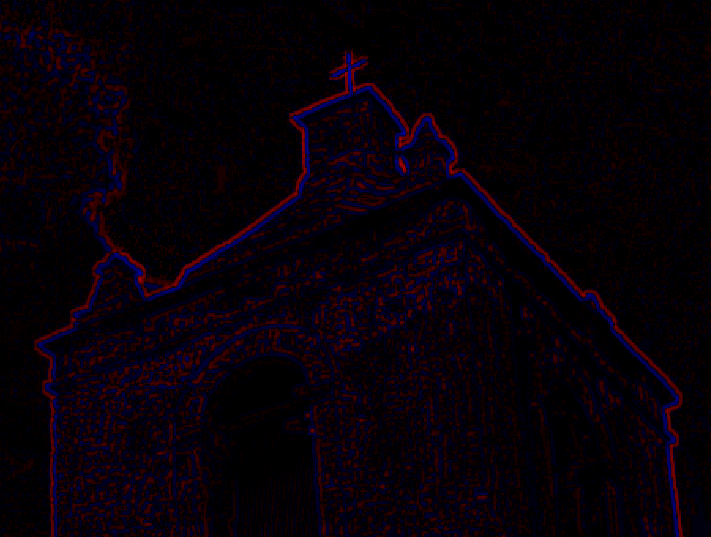

- Red means smallBlur - largeBlur is positive.
- Blue means it is negative.
- Dark means the two blurs are almost equal.

The brighter the colour the bigger the difference is.

In the church photograph, the contours of the building are surrounded by red and blue lines. This tells us that the two blurs disagree around those boundaries, so the DoG has successfully detected something noteworthy. Most slowly changing areas are dark because the two blurs contain almost the same value there.

The Signed DoG view is useful for understanding the filter, but it is not yet the image we give to Sobel. Here is where `tau` comes into play. 

`response = smallBlur - tau * largeBlur`

`response >= threshold -> white`

`response < threshold -> black`

The traditional Difference of Gaussians uses tau = 1.

The Tau Adjusted DoG Response debug view visualizes this comparison with the threshold. 

`Red pixels = above threshold`

`Blue pixels = below threshold`

Dark pixels are close to the threshold.
With the default tau = 1 and threshold = 0.005:

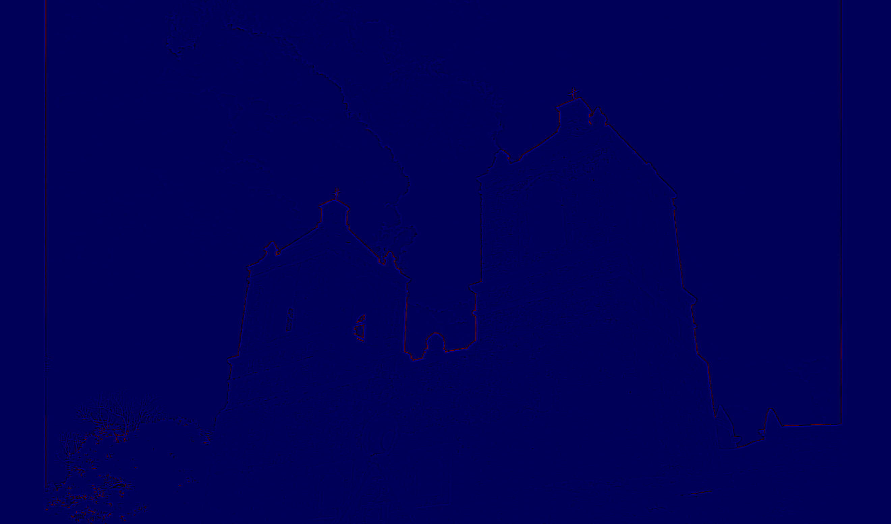

Only the strongest positive parts of the Signed DoG passed the threshold. You can see thin (sometimes broken) lines of red around the church. Most pixels are blue.

Lowering the threshold accepts more pixels. At tau = 1, lowering it all the way to zero places the cutoff directly between the positive and negative Signed DoG responses. However, changing the threshold alone did not give us enough control over how the regions expanded and connected.

tau = 1, threshold = 0.001

The more useful change was lowering tau to 0.96.

We can rewrite the response like this:

`smallBlur - tau * largeBlur`

`= (smallBlur - largeBlur) + (1 - tau) * largeBlur`

At tau = 0.96, this becomes:

`response = SignedDoG + 0.04 * largeBlur`

So we still have the normal signed difference between the blurs, but we also add a small amount of the large blurred luminance.

This gives brighter regions a larger positive boost than darker regions. If the large blur at a pixel is bright, 4% of it may be enough to move that pixel above the threshold. If it is dark, the added amount will be much smaller.

In the church photograph, the sky is much brighter than the building. Lowering tau pushes most of the sky above the threshold, turning it red in the Tau Adjusted DoG Response view. The darker church receives a smaller boost and mostly remains below the threshold, appearing blue.

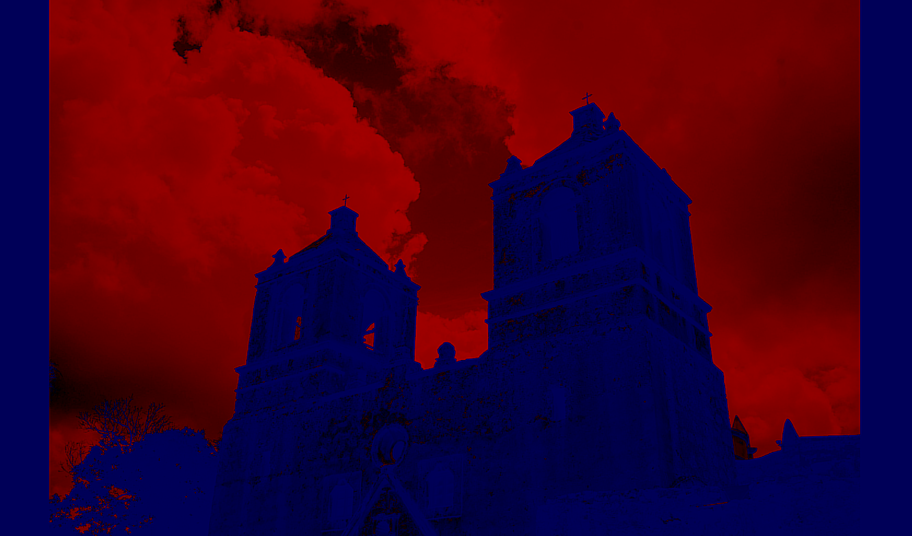

This is a much cleaner division. One larger region for the sky and another for the church. 

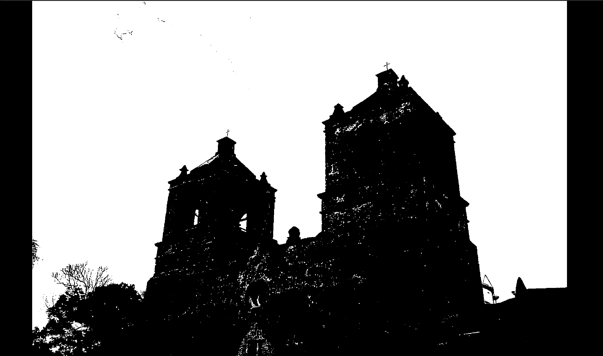

And now that we convert the result into a binary image, the sky becomes white and the church becomes black. There are still white spots inside the church. These artifacts might become an issue depending on how large they are. The small ones, however, will probably get rejected if we are smart about determining which cells become edges. 

The 0.96 value for tau was not just picked because it cleanly worked on this image; it's a good sweet spot for the range of test photos I used. 

Now that we have a simplified binary image, we can apply Sobel to find the boundaries between its black and white regions.

As before, Sobel detects the boundaries between the black and white regions. This is a much more useful job for it. Rather than asking Sobel to decide which tiny detail is important, we first simplify the image into larger regions and let Sobel find the contours between them.

This is the output of the Sobel filter. Since the image is just black and white, almost all of the output has a very high gradient magnitude. This view instead shows the gradient direction, quantized to the four directional symbols we have. You can see that the result is pretty good when it comes to the relevant contours. The artifacts are still an issue, but I hope that they get reduced once we downscale. 

## Day 4 - Rendering the edges

Now that we know where the edges are, we have to determine which cells deserve to become edge symbols and which do not. 
Here are the church image's cells. The more edge pixels a cell has, the brighter it is.
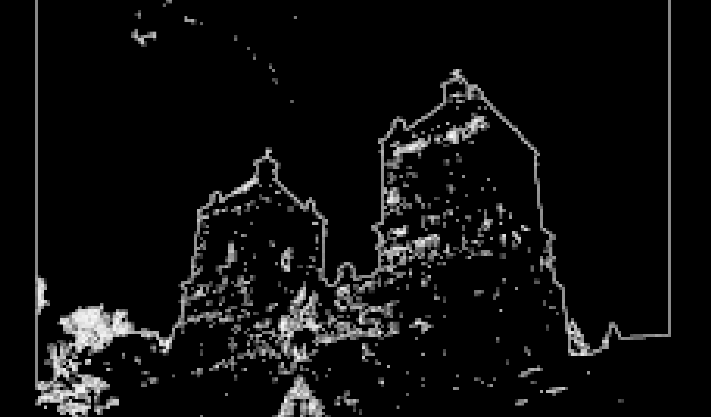

We need to factor in:
- How many potential edge pixels we have in our cell.

- The total Sobel strength 

- The dominant direction of the edge

- The direction coherence (what if we have disagreeing edges wanting separate things?)

`coherence = length(axialSum) / totalStrength;`

`orientation = 0.5 * atan2(axialSum.y, axialSum.x);`

- We also need to treat opposite gradients as the "same".

- We also treat opposite directions as the same line direction. A dark-to-light vertical edge and a light-to-dark vertical edge should both produce |, not two different answers.

- Lastly, since Sobel gives us gradient direction, we need to convert it to edge direction. A vertical line = horizontal gradient.

The solution ended up being simpler than I expected. Each accepted edge pixel just votes for the kind of line it belongs to. Each cell ends up with four vote counts: one for each possible edge glyph. This gives us a simple directional histogram for the cell.

A cell becomes an edge candidate when:

- enough edge pixels voted for its strongest direction;

- that direction makes up a large enough share of all votes in the cell;

- the strongest direction has strictly more votes than the second strongest.

The result of the cell direction election:

The final selected cells after considering edge dominance

Then we just have to render the correct symbol for each cell. For every pixel on the screen, the shader checks which cell it belongs to, checks that cell's directional candidates and votes, then samples the corresponding glyph from the texture. If there is no edge, we skip it and output the background image. Now we can see only the edge ASCII before we combine it with the normal ASCII image.

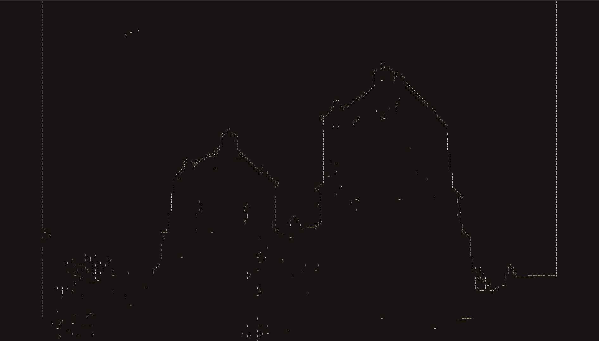
(The artifacts do not look too bad now that it's rendered out)

Lastly we just need to combine the two ASCII images. I kept it simple: if there is an edge in the cell, we prioritize the edge over the luminance glyph. Otherwise we render the luminance glyph. 

Note that the two systems work at different resolutions. Luminance is downsampled per cell, while edges are detected at full resolution and aggregated into cells near the end.

Here is the combined result:

Hmm, we could use more glyphs to represent this image's tonal range. 

Here are the results from all other test images:

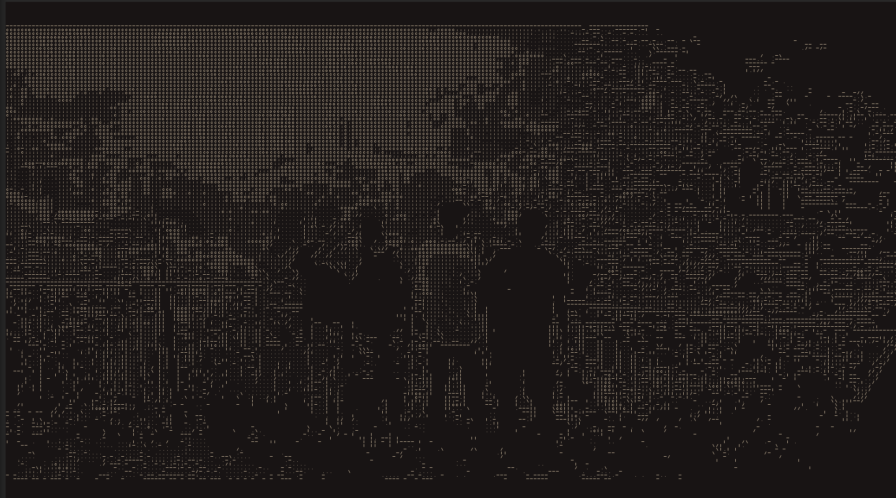

## Day 5 - Performance and Optimization

So far the only performance checks I've done are playing the animations in the 3D test environment. All I know is that the performance is "smooth", with no real knowledge of how many resources the calculations are actually taking up. 

So let's fix that shall we. 

The shader is first and foremost post-processing, so the game image is already rendered before we start processing it. So all of our work is added on top of rendering the game itself. 

A lot of the computational work depends on how many pixels the screen has. Because we need many intermediate steps, we read full-resolution textures many times and write a new full-resolution result after each pass. 

The reality is a bit more complex than this but it gives me a good understanding of the scale.

Ok so let's go over some important processing steps (not in chronological order):

- Convert camera image from colour to luminance

This is relatively simple: we read the screen once, combine the RGB values in a specific way, and then write the output luminance texture.

- Render the final glyph image

This is also relatively simple. We have the tiny glyph textures ready, so the GPU can probably keep most of them close in its cache. Sampling the glyphs themselves does not require much complicated math.

- Gaussian blur

The specific Gaussian blur I used has two passes: one horizontal and one vertical. Each uses a 5-pixel kernel. So that's equivalent to around 10 texture samples per output pixel in total. We do run two Gaussian blurs for the DoG, but since they have the same radius but different weights, we only need to run the blur passes once and store the results in two different texture channels. 

The Gaussian weights themselves are also a bit complex, since exponentials are more expensive than basic arithmetic. Currently we calculate them every time we need to find the weights, which might be expensive.

- Sobel filter

The kernel for the Sobel filter has 8 pixels/values, so that's 8x screen reads and 1 output write.

- Sobel filter output

This is the most complex texture we handle. The filter outputs a bunch of information, we store it using an RGBA16F format, so 16 bit floats in 4 channels. 

R = horizontal gradient, Gx
G = vertical gradient, Gy
B = accepted-edge flag
A = unused

This is so that the aggregation pass can read them and make a decision on which edge glyph to use. But we are actually allocating more storage space than we need. The accepted-edge flag is derived like this:

`accepted = length(gradient) > epsilon ? 1.0 : 0.0;`

This is extra information since we can derive the same boolean later using information we already have. The alpha channel is also unused, so we really only need 2 channels to convey all the information we need. (less memory use)

### Benchmark results

I created a benchmark that compares three rendering modes.

1. Baseline, no ASCII
2. Luminance-only ASCII
3. Edge-aware ASCII

Here are the results (GPU):

- Baseline: 0.366 ms

- Luminance-only: 0.458 ms (+0.092 ms compared to baseline)

- Edge-aware: 0.566 ms (+0.108 ms compared to luminance only)

So the complete effect added a total of 0.201 ms. CPU frame time difference was only 0.073 ms. These are very low numbers, but I am on a 9070 XT so these numbers will increase for an average computer. 

Total frame time difference for the effect should be around 1.2% of a 60FPS target or 2.4% of a 120FPS target.

I also tried to render at 4K, where the complete effect cost (GPU + CPU) increased from 0.22 ms to 1.49 ms in the editor. 4K means 4 times the number of pixels, but the shader took 6.8 times longer to run, so some aspects are scaling worse than expected. 

Overall the shader is quite cheap at 1080p, so there is no rush to optimize. I don't have a specific target for optimization; the initial plan was "real time" so I guess that means 60 FPS. 

## Day 6 - Dynamic Luminance Quantization

### The idea 
One issue I noticed with the portrait test photo was that many areas consisted of blank glyphs. The cells were determined to be too dark, so nothing was rendered. You can see that the background, some of the foreground, and the subject's hair are blank. Whereas in the real photo, those areas range from truly black to important subject areas that happen to be darker. 

So what is going on here is that the dynamic range of the image is narrower than the entire luminance band we have glyphs for. This photo for instance only has luminance ranges that render out 7 out of 10 glyphs. So the ?, @ and square is never even used. This is not the fault of the image, it was taken at night and just happened to not have strong highlights and strong shadows at the same time. 

So what can we do about this? Ideally we would want to use as many glyphs as possible to represent the image. Maybe we could create a way to force all 10 glyphs to be used at the quantization stage. Let's say luminance is represented continuously on a scale from 0-1. The way we currently quantize luminance is to count the number of glyphs we have (10) and evenly distribute them across the luminance range, so glyph 1 would be 0-0.1, glyph 2 would be 0.1-0.2, etc. 

This would make sense if we were doing posterization. If we were quantizing colours stylistically, we would want a colour to still be somewhat similar after quantizing. But since we are dealing with ASCII glyphs (that are the same colour and luminance as each other), we care less about absolute luminance and more about relative luminance. 

So if an image only ranges from 0-0.5 in terms of luminance, maybe we could fit all 10 glyphs inside that range instead. That would mean that we get more available glyphs to render the photo, which would represent luminance gradients better. No more crushed blacks or whites. Also, when determining "dynamic range", what we really care about is the brightest and darkest cell, not pixel. A single bright pixel does not mean that we need to render a bright glyph. So this tells me that we need to do the calculation on the downscaled luminance image. 

I can also foresee a general mismatch of luminance across different images. An equally bright area in two photos might be represented by two different glyphs depending on the dynamic range of the image. Is this fine? Artistically I am leaning towards yes since it makes each individual image look better, at the cost of consistency. 

We could take our quantization logic even further. Each glyph has a statistical "brightness", measured by how many lit pixels it has compared with unlit pixels. Our current way of quantizing glyphs assumes that each glyph is evenly distributed in terms of brightness, when in reality the number of lit pixels in each glyph does not increase steadily. (not sure how much of an impact this will have though)

### Remapping Black and White points

The safest first thing to do is a manual check to see if narrowing the luminance band will produce a favourable result. No algorithm that determines exactly where the black and white point is yet.

So basically I added a way to remap each cell's luminance value (without touching the full resolution texture).

Here is the church test image again. You can see that remapping luminance from 0.0-1.0 to 0.0-0.5 changes the output a lot. Any cell above 0.5 is clipped to 0.5; these are the red cells in the luminance-range clipping image. The selected 0.0-0.5 range is then stretched across 0.0-1.0 before we quantize it evenly. 

  
   
  <em>Luminance range clipping: green cells are inside the selected range, while red cells exceed the 0.5 white point.</em>

Imagine the histogram of the image before and after remapping. Most values were originally below 0.5. We clipped the values above 0.5 and stretched the remaining histogram so that it occupied the entire 0-1 range. 

| Original cell luminance | Remapped cell luminance |
|:---:|:---:|
| 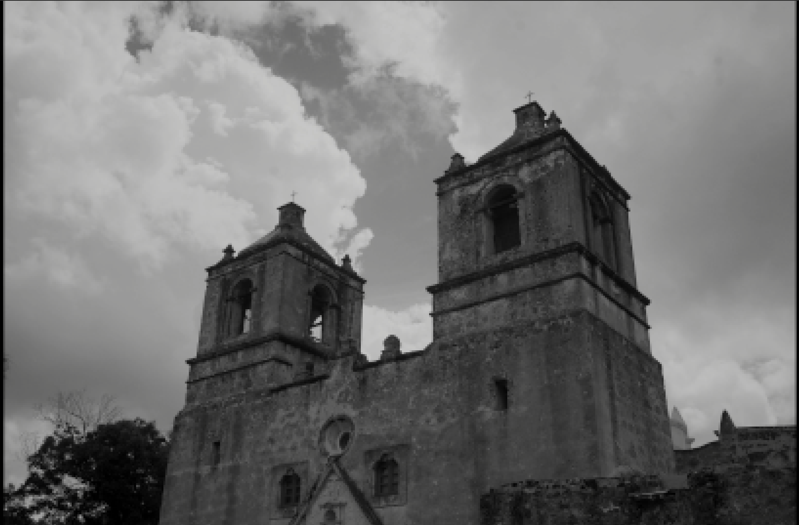 | 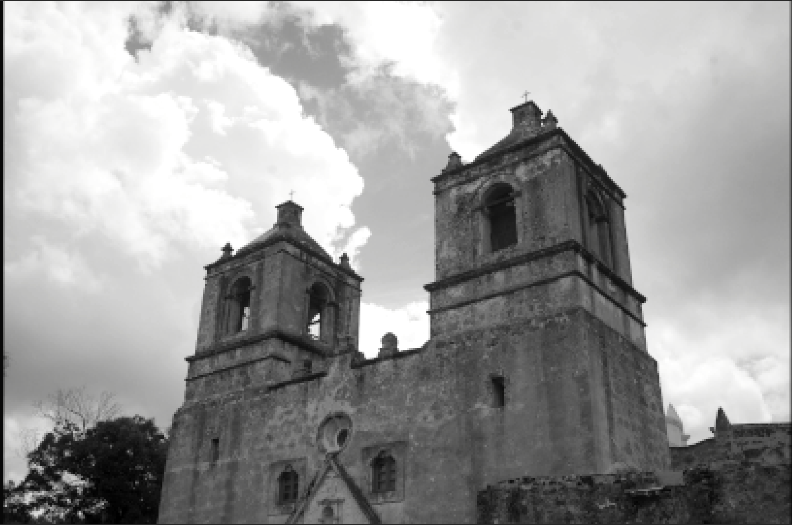 |
| Original 0–1 mapping | The 0–0.5 range stretched across 0–1 |

Now, cells that were close to 0.5 in luminance get assigned the brightest glyphs instead of a medium-bright glyph. You can see that the background clouds have some brighter spots now. 

Areas that were previously on the darker side get brighter after remapping. You can see that the church itself was mostly made of blank glyphs but now has some texture to it.

| Without luminance remapping | With luminance remapping |
|:---:|:---:|
|  | 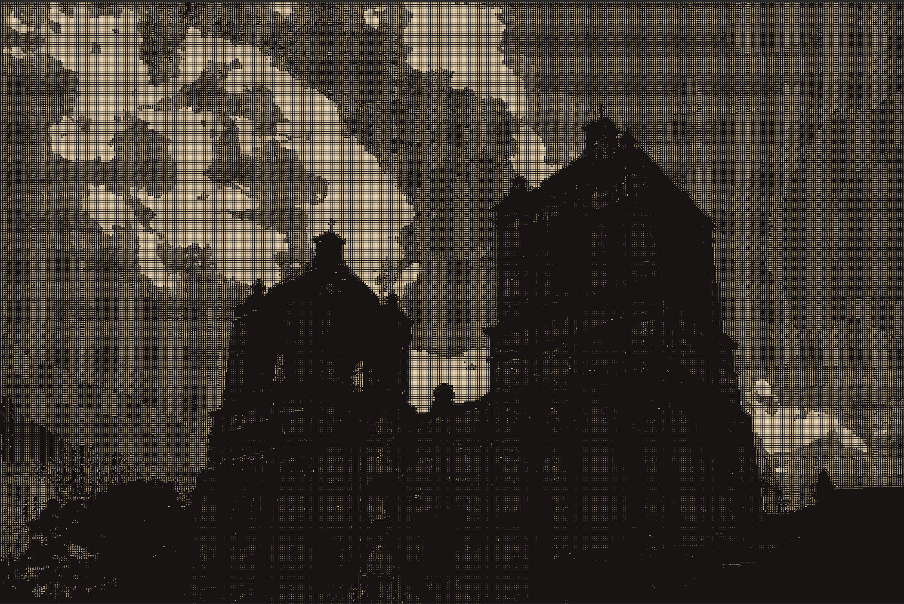 |
| Much of the church selects blank or sparse glyphs | More of the glyph ramp represents the church |

Note: the 0.5 white point I chose was arbitrary, we should ideally find a good way of determining a white and black point automatically. 

### Automatically determining black and white points

An important distinction is the difference between the literal brightest and darkest cells in the image and the brightest and darkest cells that are useful for describing it.

We could just find the literal min and max luminance of the image. So if an image only ranges between 0.05-0.65, we remap that to 0-1. But that would leave us vulnerable to outlying cells. What if a bright light source at luminance = 0.95 exists? That would limit our remapping even if the rest of the image is fairly dark. 

A better way would be to look at percentiles. But that requires sorting and I kinda just want to see how well the dumb version works first. 

The obvious way of finding the min and max is to let the CPU do the work. It would involve sending the cell texture to the CPU, then asking it to run something akin to:

`minimum = Mathf.Min(minimum, luminance);`

`maximum = Mathf.Max(maximum, luminance);`

But that would involve transferring the result of previous processing to the CPU and making sure the CPU and GPU synchronize. So we should keep the work on the GPU. But on the GPU we can't just ask it to loop through the image and keep track of min and max like we do on the CPU; we have to tell it to work in parallel. 

The plan is to use a reduction chain. The grid of cells we have is 240x135 (1080p). We send out a GPU thread for each 2x2 group of cells. Each thread performs its own min or max calculation and outputs the result as one pixel. Many of these threads run in parallel. From this we get a downscaled texture containing all the "winners". We keep repeating the process until one cell remains, giving us the brightest or darkest value. This is a very dumb but fast way of finding the min or max. We only care about the value of the cell, not its position, so it's okay. 

I ran the automatic black and white bounds on every test scenario I had, and the results were interesting. All of the images were bound around 0-0.5, coincidentally what I tested with, while the 3D environment's range did not deviate much from 0-1. So if the test images I have are anything to go by, then we are effectively doubling the dynamic range. A dark area with a luminance of 0.1 effectively becomes 0.2 after remapping. 

(Since the automatic bounds detection gives the same bounds as my testing, see the previous church image for reference)

### Preventing excess quantization

Let's say an image is just one shade of grey. It would be dumb to start analyzing dynamic-range bounds and remapping its luminance. We would be dividing a tiny luminance range to fit 10 glyphs, while in reality the image is just "one colour". So we need a minimum range where we actually decide to remap stuff. 

A convenient minimum we could use is `minimum_range = 1 / glyph_count`. Which for me is 0.1. So if an image only ranges enough to need one (or less) glyphs to represent everything, we just skip remapping and keep the 0.1 range. That would result in the image becoming only one glyph. 

The issue with that is if an animation crosses the boundary and goes from 0.099 to 0.101, we would get a weird jump. So we will need to ease it in a bit:

    range <= one glyph step:
        use fixed mapping

    range >= two glyph steps:
        use full automatic remapping

    between them:
        gradually blend from fixed to automatic

### Problems when introducing motion

The automatic bounds worked well for static images, but video games introduce another requirement: the result must remain stable between frames.

The shader currently calculates new black and white points independently for every frame. This means that a bright or dark object entering the camera can change the luminance mapping for the entire image.

For example, imagine that a cell has a luminance of 0.25:

    Frame A bounds: 0.0–0.5
    Remapped luminance: 0.5

    Frame B bounds: 0.0–1.0
    Remapped luminance: 0.25

The cell itself did not change, but a bright object entered somewhere else and increased the detected white point. The unchanged cell can suddenly move several positions down the glyph ramp.

Because glyph selection is quantized, this does not appear as a subtle brightness adjustment. Many cells can suddenly switch symbols at the same time. During testing, this appeared as flickering and unintended changes across otherwise stable parts of the image. The luminance bounds are global values, so a local change can affect every cell on screen.

So how do we fix this?

One option would be to smooth the detected bounds over time. Instead of immediately using the newest bounds, we would gradually move toward them.

This would reduce sudden jumps, but the shader would temporarily use information from older frames. Highlights could remain clipped while the white point catches up, and camera cuts could briefly use the bounds from the previous shot. This improves stability at the cost of responsiveness and accuracy.

Another option would be percentile bounds. Instead of using the literal brightest and darkest cells, we could ignore a small percentage of extreme cells.

The ignored cells would still become the brightest or darkest glyphs, but they would no longer control the mapping of the rest of the image. This would probably reduce the flickering caused by small highlights. However, we would have to decide how many cells are allowed to be ignored. A genuinely important highlight could be treated as an outlier, and different scenes might prefer different percentiles.

We also considered deadbands and requiring an extreme value to remain for several frames before accepting it. These approaches can reject small or temporary changes, but they either delay real changes or still allow larger jumps.

Every solution introduces some form of lag, ignored information, or arbitrary threshold.

### Final Decision :(
    
For animated content, using every glyph is less important than preserving stable and accurate motion.

Because of this, the default real-time mode will keep the original fixed 0–1 luminance mapping. A cell with the same luminance will continue selecting the same glyph regardless of what enters another part of the screen.

Automatic min/max remapping will remain available for static images. The photographs consistently benefited from the expanded range, and static images do not suffer from temporal flickering.

The public shader therefore has two modes:

Stable: fixed luminance mapping intended for games and animation

Adaptive Static Images: automatic min/max remapping intended for photographs

Stable is the default. The shader does not try to detect whether the source is moving; the mode represents the intended use.

This changes the goal slightly. We are no longer trying to force every frame to use the complete glyph atlas. We use more of the ramp when it can be done safely, but temporal stability takes priority for real-time rendering.

A future alternative could be an atlas containing more glyph densities. A larger fixed ramp would provide more tonal variety within a narrow luminance range without changing the mapping between frames.

## Day 7 - ReShade porting

Ok I have never touched ReShade before, I have only downloaded it to use a preset someone made. Let's see how this goes. 

This is as far as my ReShade experience gets me for free:

ReShade effects are written in .fx files using a language similar to HLSL. Instead of using Unity C# and Render Graph to schedule the work, the effect file declares its own textures, shader passes and technique. Which is kind of nice, working on the renderer feature was a pain. 

Before testing real games, I used a Windows build of the Unity test environment as a controlled ReShade host. The actual port of the algorithm was built back up in stages:

1. cell sampling and luminance glyphs

2. glyph atlas rendering

3. color modes

4. full-resolution luminance and Sobel

5. Gaussian and Difference-of-Gaussians preprocessing

6. directional edge classification

7. edge glyph rendering and the final composite

There was one issue when I tried to port over the algorithm. The ReShade result had the correct structure, but it consistently selected brighter and denser glyphs than Unity. The problem was not the cell grid, averaging or quantization. ReShade was reading the game’s final sRGB backbuffer, while the Unity implementation performed its calculations using linear color values.

sRGB values make most midtones numerically brighter. If those values are used directly for luminance calculations, cells move further up the glyph ramp.

The solution was to convert every source pixel from sRGB to linear before it contributes to the cell average. After adding this conversion, the ReShade and Unity glyph selections became basically identical. 

Even the "Made with Unity" screen was made of ASCII glyphs now that the entire build was affected by the shader.

### Using the Shader in actual games (Expedition 33)

This is a good time to show what the shader currently looks like in actual games

| Landscape: ASCII OFF | Landscape: ASCII ON |
|:---:|:---:|
|  |  |

| Portrait: ASCII OFF | Portrait: ASCII ON |
|:---:|:---:|
|  | 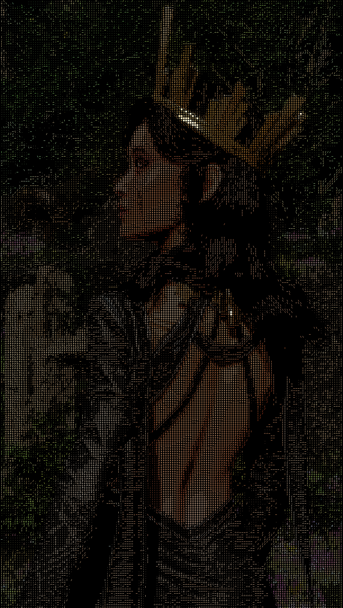 |

When it comes to luminance, you can see that the shader is quite good already. Any direct improvements that I can see would come from adding more glyphs. But this is totally usable. 

As for edges, real games sometimes introduce a much more complex image for us to analyze, which results in inconsistent edges in some areas. Many of the edge issues are inevitable when we lose detail during downscaling. However, there are still some things we could do about them (I'll discuss this later).

Using this shader in an actual game introduces more issues, such as flickering and noisy output. I dealt with similar visual artifacts during dynamic luminance quantization (they were the reason it was scrapped). Here, however, the flickering is substantial even when nothing is visually changing. 

The test images from E33 were captured using the in-game photo mode, where all animations were paused, yet the ASCII output was still noisy. This is more of a problem since nothing is happening inside the game, yet the shader perceives a lot of "movement". 

I'll compile all the issues and potential improvements here:

- Flickering/noisy output, even when there isn't any animation. We should find a way to prevent this, or smooth the output to make it less harsh. We also need to make sure that any measures we take against noise do not come at the expense of real animations.

- The cell tint colour mode might need an upgrade. Currently the colours are way too harsh, since they have full saturation and luminance. We need a nuanced upgrade that improves colour accuracy, and takes the luminance of the glyph colour and the luminance of the cell's colour into account. Currently we disregard luminance and saturation, and rely on the density of the glyph to fake luminance, that might not be enough now that we are working with a detailed game world. We can discuss what specifically to try later.

- Edge detection struggling in certain areas. We can't make edges perfect with limited detail, but we can now use the depth buffer to inform our choices for edges. Adding more ways of detecting edges (and maybe tuning down our current edge detection) might improve edge detection as a whole.

- A stylistic improvement would be to only draw edges within a certain distance of the camera. This way, characters and detailed close-up objects get defined edges while the background becomes smoother. 

- Another improvement is to control the opacity of the glyphs. We could fade out glyphs that are farther away from the camera. 

- I also have ideas on what other effects that might work well with this shader. But we can think about that later. 

More Images of Lune:
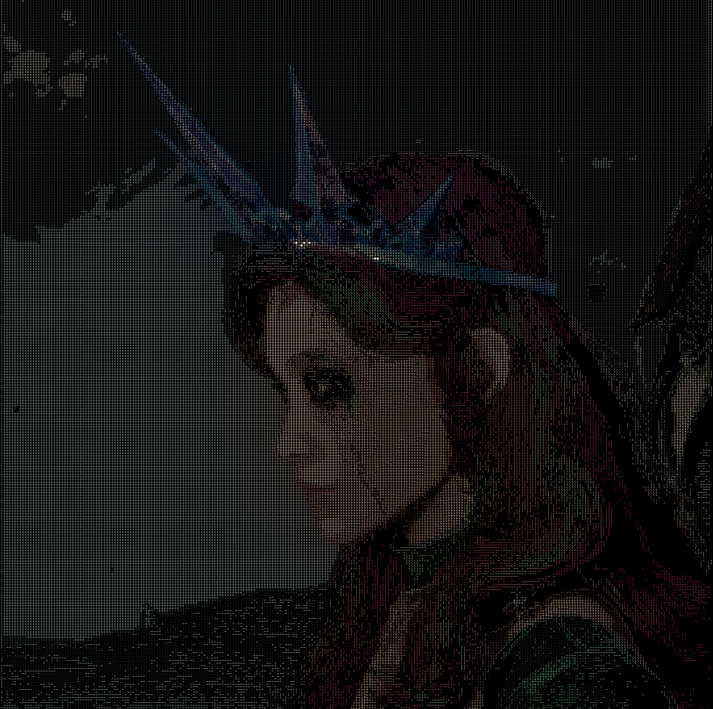

## Day 8 - Stability, colour and depth

### Temporal Stability

A lot of the noise probably comes from rendering techniques like TAA and upscaling. You can't avoid these things in modern games, so we have to deal with them. These methods deliberately change or jitter pixels between frames; however, the changes are so small that you normally can't see them. But our shader makes a lot of decisions based on hard thresholds, so the jitter will sometimes cross a threshold between frames, creating noise.

A tiny luminance change can move a cell across the boundary between two glyphs. Edge detection is even more sensitive. A small change can alter the binary DoG result, which changes the directional votes inside a cell. That cell can then switch between being an edge and not being an edge, or switch between two edge directions.

The final candidate mask is binary, so a small change in a few source pixels can change an entire 8x8 cell. This made the edge noise look much stronger than the noise that caused it.

I only noticed this now because I had been working with static images and very simple Unity animations. Once we could test in real games, we finally encountered the issue. 

I did not want to average multiple frames together.
That would basically entail averaging multiple frames together to smooth the motion. It would reduce the noise, but it would also blur movement and make the shader slower to react to stuff. 

So instead, I created separate requirements for edges depending on whether the previous frame contained an edge. 

Creating a new edge has fairly strict requirements:

    Entry support: 8 pixels
    Entry dominance: 0.65

Once an edge exists, it is allowed to remain with slightly weaker evidence:

    Retention support: 6 pixels
    Retention dominance: 0.3

This creates a small safe region between appearing and disappearing. For example, an edge that fluctuates between seven and eight supporting pixels no longer repeatedly turns on and off. It must reach eight pixels to appear, but once it exists it can remain until its support falls below six.

The shader also remembers the previous edge direction. A new direction must beat the retained direction by three votes before the glyph is allowed to change. This prevents small variations in the directional histogram from repeatedly swapping between -, |, / and \.

This is not enough for history to preserve an edge on its own. The current frame must still contain enough evidence supporting it. If the edge actually disappears, the stored edge is removed instead of leaving a trail.

### Cell tint improvements

Next I wanted to address the Cell tint colour mode. It was initially added for fun to make the glyphs have the colours of the objects behind them. The original Cell Tint mode only cared about the general colour of the cell. It divided the colour by its brightest RGB channel, which preserved its hue and saturation but always forced its HSV Value to 1.

This made sense since hue and saturation belonged to the tint of the glyph, while the luminance (value) belonged to the glyph density. We already represent darker and brighter areas with different glyphs, so making the glyph's colour brighter or darker felt redundant. 

However with the shader in action it often felt like the colours were too intense, especially in darker areas. The contrast between the fully bright glyphs and the blank glyphs was stark, making it hard on the eyes. 

To improve this, I added a Value Influence setting. It blends between the original full-Value colour and the actual Value of the source cell.

    0.0 = original full-Value tint
    1.0 = complete source-cell Value

Using the complete source Value was too strong because glyph density was already trying to represent the same luminance. Dark glyphs became difficult to see and too much colour detail disappeared.

Values around 0.6–0.7 produced the best artistic result, with 0.65 being a good general setting. It allows the source Value to affect the colour without completely replacing the work done by glyph density.

The two extremes show the tradeoff between colour visibility and softer contrast:

| Value Influence: 0.0 | Value Influence: 1.0 |
|:---:|:---:|
|  | 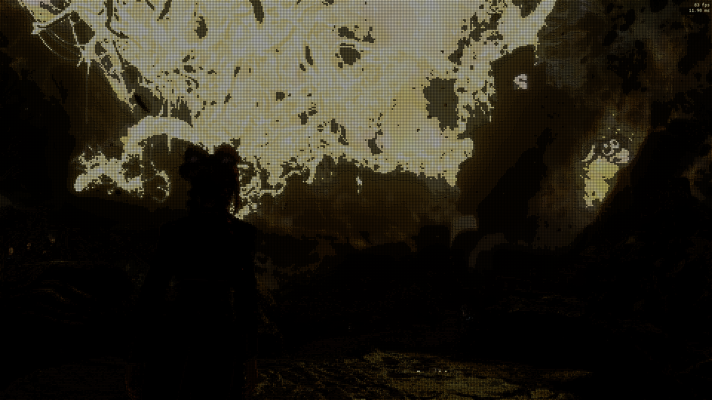 |
| Every glyph uses full Value, preserving detail but producing harsh colours. | Dark glyphs blend into the background, but too much colour detail is lost. |

The chosen compromise keeps much of the softer contrast without losing as much detail:

| Value Influence: 0.65 |
|:---:|
| 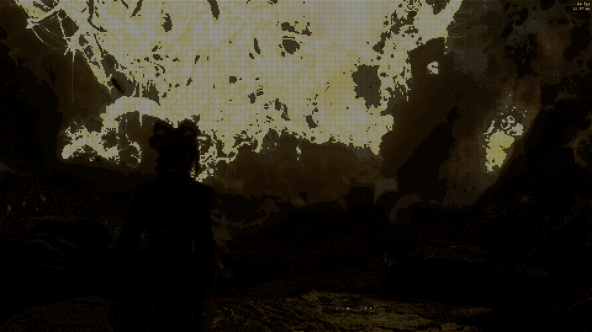 |
| Dark areas are calmer while foreground colours and important details remain readable. |

### Working with depth

Adding depth knowledge will probably improve most aspects of the shader. Here is the linearized and reversed depth buffer I get from ReShade.

The brighter the pixels get, the farther away they are from the camera.

Since the depth buffer contains few tiny details and is not affected by lighting or textures, we can skip the DoG preprocessing step and directly run the Sobel filter on the depth buffer. 

After running Sobel we get this:

Brighter = More likely an edge
You can immediately see that the places where we want to draw edges are already white. However, we are getting a lot of artifacts.

1. It looks like it is snowing. The game renders particles that have depth. When they are placed against a background, Sobel sees the difference and colours it white.

2. The background objects are also super white. This makes sense since they are equally well-defined and sit against a faraway background. However, we should ideally care more about depth edges when they are closer to the camera. 

3. We are getting the same noise we observed when first porting to ReShade, so we might need to run similar temporal stability measures as before.

### Prioritizing closer edges

The Sobel filter only tells us how large the difference in depth is. It does not understand whether an edge belongs to an important foreground object or an unimportant building in the distance. 

To fix this, I added a proximity weight. For every Sobel sample, the shader looks at the closest depth in the surrounding 3x3 area. Edges close to the camera keep their original strength, then gradually become weaker as they get farther away. At a certain distance, they disappear completely.

Before:

After:

After applying the proximity weight, the very strong edges around distant buildings were reduced. I then applied a relatively strict magnitude threshold. Real object silhouettes normally produced much stronger depth gradients than small particles and other artifacts, so this removed a large amount of the unwanted depth information.

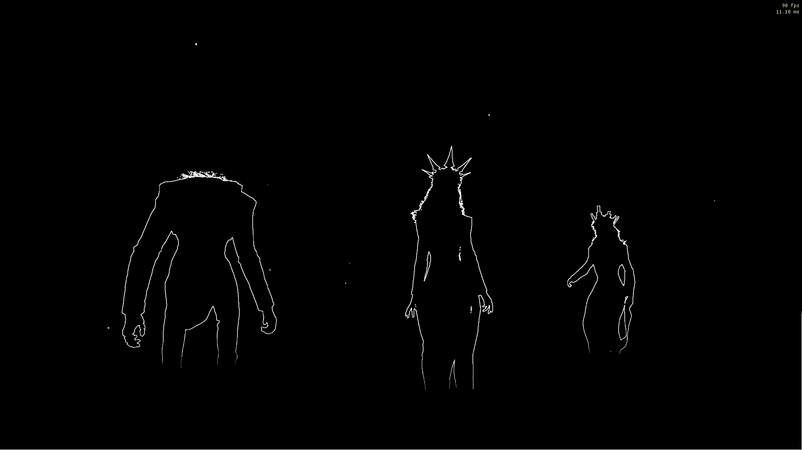

Using the same voting system as the image-edge aggregation, but with slightly tweaked settings, gives us a rendered ASCII version of the depth-detected edges.

But we still need to address temporal stability. Hair and other thin shapes were still noisy. They could create a valid edge in one frame and then lose most of their support in the next frame because of small changes in movement, TAA or the depth buffer.

I reused the temporal hysteresis system from the image edges, but with more forgiving retention settings:

    Entry support: 10 pixels
    Entry dominance: 0.5

    Retention support: 2 pixels
    Retention dominance: 0.1
    Direction switch margin: 3 pixels

The strict entry requirements prevent weak particle edges from appearing in the first place. Once an edge has proved that it is real, the forgiving retention requirements allow it to survive temporary drops in evidence. We can get away with this because the important depth contours are less prone to the kind of noise that affects luminance-based edge detection. 

### Combining image and depth edges

Now that we have edge information from two sources, I had to decide what to do when the two systems disagreed on whether there should be an edge or not (or which orientation the edge is in). Both systems are useful and good at different things. Image edges can see edges caused by colour and texture, while depth edges are much better at finding silhouettes of objects. 

The simplest way of doing this is to combine the final decisions made by each system instead of merging their intermediate data earlier. 

- If there is a valid depth edge -> use its direction
- Otherwise -> use the image-based edge information
- If neither system detects an edge -> use the regular luminance glyph

This way, depth edges get priority since they are more likely to be edges we perceive as real.

Here is the final result:

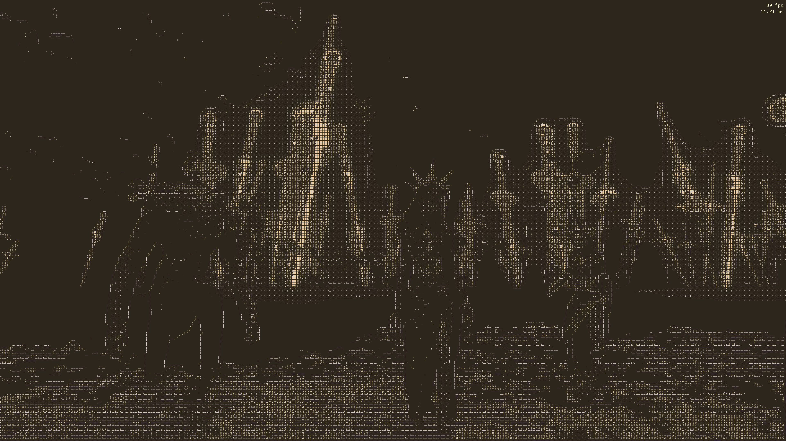

## Day 9 - Expanded glyphs and colour palettes

### Extending the glyph atlas

The original shader used ten luminance glyphs. This looked good and was enough to represent the complete luminance range, but each glyph covered a relatively large range of brightness. This meant that subtle gradients, shadows and highlights could lose detail. 

I wanted to see what adding more glyphs would do to the image. So I manually created a second atlas containing sixteen 8x8 glyphs. The glyphs are still completely binary. 

The 16-glyph atlas became the "extended" glyph set; 10 is still the default.

Default set:
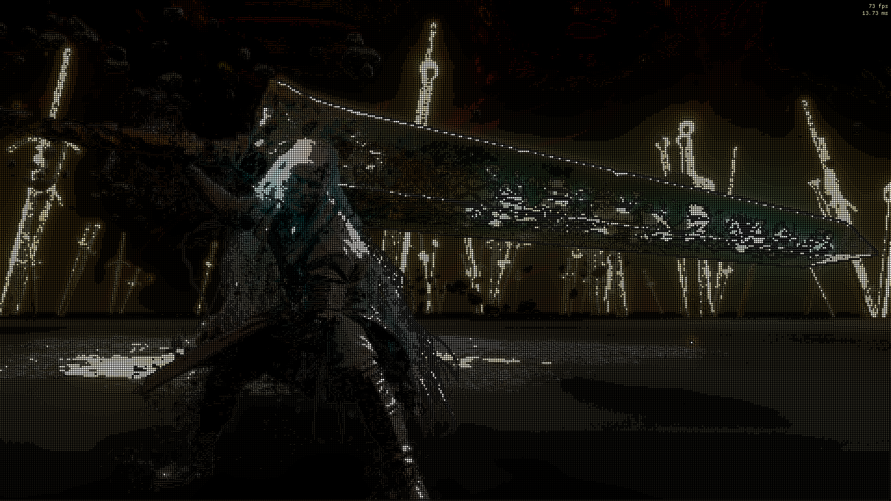
Extended set:

The Extended set produces finer gradients and preserves more information in shadows and highlights. It also leaves fewer cells completely blank. This makes the result slightly brighter overall because the blank glyph now represents a smaller portion of the luminance range.

The two sets do not have exactly the same overall brightness because their glyph-density distributions are different. Properly calibrating every glyph by its perceived brightness could make them match more closely, but then we run into more issues that I don't bother dealing with. It already looks good as is. 

### Overhauling the palette colour mode

The original Palette mode was very simple. It only had one background colour and one foreground colour. Every visible glyph used the same foreground colour regardless of its density.
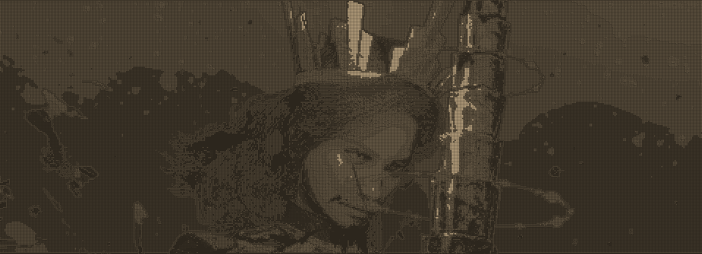
This worked well for lower-contrast monochrome styles, but it did not really take advantage of having multiple glyph densities. I wanted the darker and brighter glyphs to use different colours while still preserving the luminance structure of the image.

The new palette would contain 6 colours:

    Slot 0: Background
    Slot 1: Darkest foreground
    Slot 2: Dark foreground
    Slot 3: Middle foreground
    Slot 4: Bright foreground
    Slot 5: Brightest foreground

The Extended glyph set uses all five foreground slots. The Classic glyph set only uses three of them because it has fewer glyphs, but it still samples the darkest, middle and brightest parts of the same palette.

Edge glyphs use the colour that the original luminance glyph would have received. This means replacing a luminance glyph with an edge does not introduce an unrelated colour.

The shader still supports manually selecting every colour. There is now a two-colour manual palette and a six-colour manual palette. However, selecting six colours that have predictable brightness and look good together is quite difficult, so I also wanted a generated option.

### Generating colours with OKLAB

RGB is not very convenient for generating palettes. Changing an RGB colour’s hue can also change how bright it appears, even when its numerical brightness looks similar.

Instead, the generated palette uses Oklab/OKLCH. This colour space is designed so that its lightness value is closer to how humans perceive brightness.

Rather than exposing the technical Oklab axes, the shader presents three familiar controls:

    Palette Hue
    Palette Brightness
    Palette Colour Intensity

Hue controls the base colour. Brightness controls the perceptual lightness of the middle foreground slot. Colour Intensity controls how colourful the palette is. The shader then creates five foreground colours with increasing Oklab lightness. The background is generated using the same hue system, but is made darker and less colourful. Some combinations of hue, lightness and colour intensity cannot be displayed by a normal monitor. When this happens, the shader gradually reduces the colour intensity until the colour fits inside the displayable RGB range.

### Colour Harmonies

Once the lightness ramp worked, I added several ways to distribute hues across it.

- Tonal uses the same hue for the complete palette. Only lightness and colour intensity change.

- Analogous spreads the five foreground colours across a configurable section of the colour wheel. The colours remain relatively close to each other, creating a smooth and cohesive palette.

- Complementary uses two colours on opposite sides of the colour wheel. The background and two darkest foreground slots use the selected hue. The three brightest slots use its complement.

- Triadic uses three colours separated by 120 degrees. The background and first foreground slot use one hue, the two middle slots use the selected hue, and the two brightest slots use the final hue.

All four methods use the same Oklab lightness ramp, so changing harmony should alter the colour relationships without destroying the brightness ordering.

Tonal:
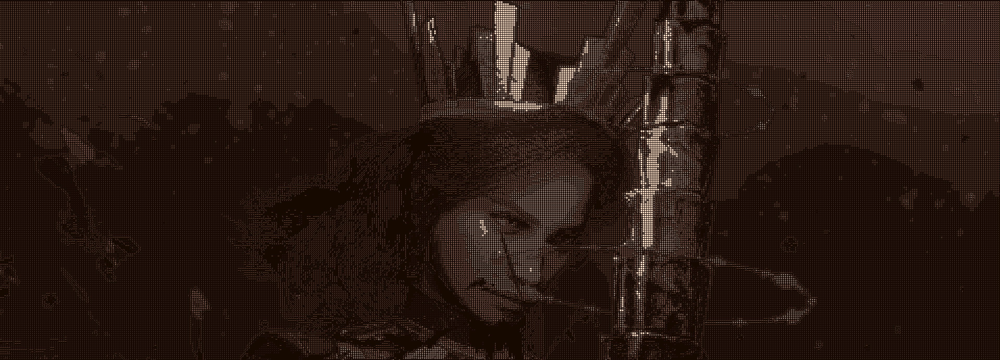
Analogous:
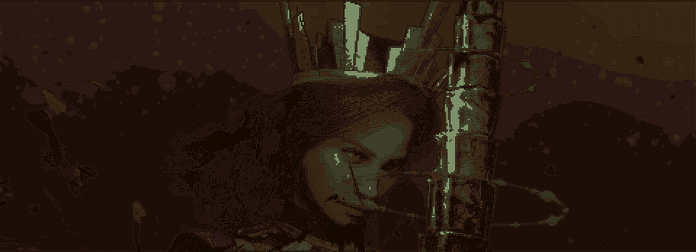
Complementary:
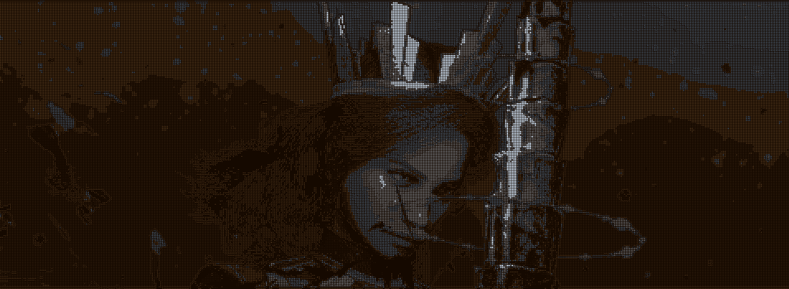
Triadic:

While playing around with the colour harmony settings, I found that the ranges consistently produced reasonably good results. This made it possible to add a semi-random palette button. It does not generate completely arbitrary values. It selects values from the ranges that I already found usable.

Despite the simple randomization, the results were surprisingly consistent and visually pleasing:

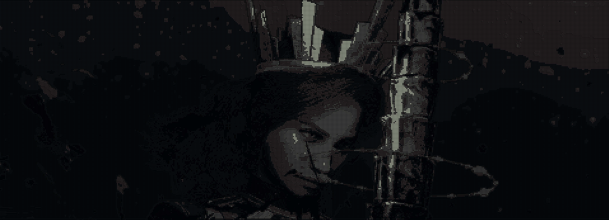
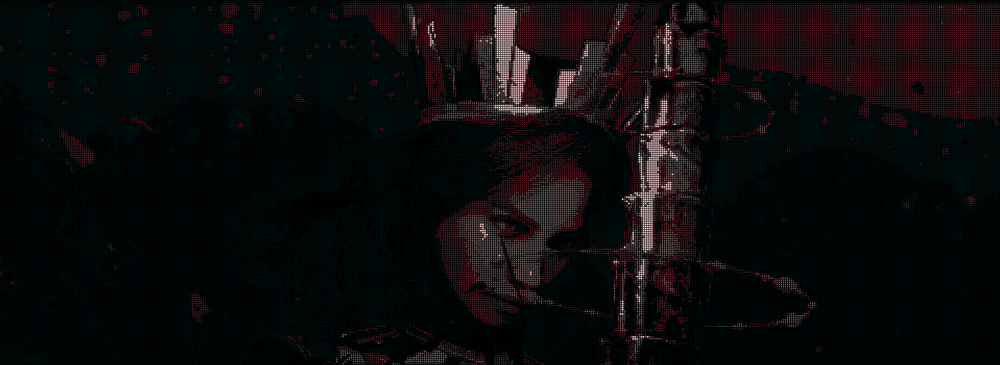
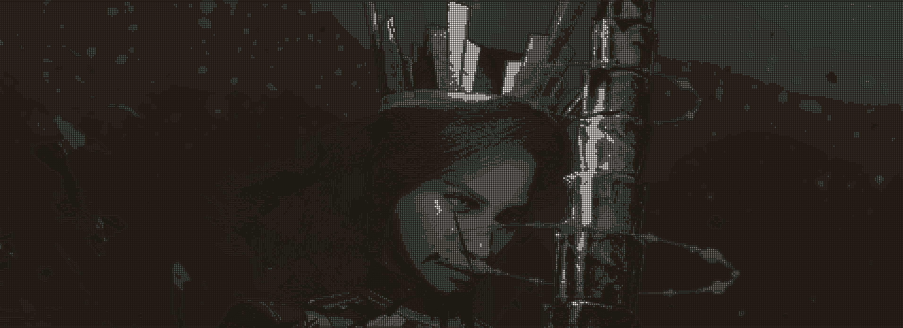
